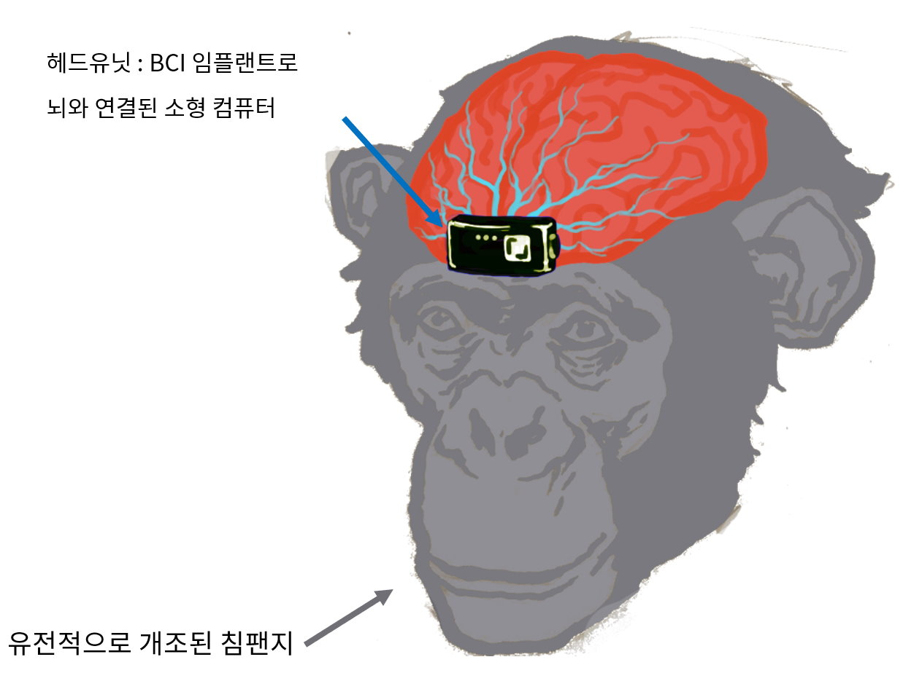

# 노인과 지맥

과기정통부와 한국과학창의재단 주관 '과학스토리텔러' 과정에서 쓴 단편 SF의 소스코드입니다. 동 과정의 다른 작품들과 함께 [페트로글리프](http://www.yes24.com/Product/Goods/91900680)라는 단편집으로 출간되었습니다. 그냥 내용만 읽고 싶으신 분은 [노인과 지맥](http://alphax.me/archives/126)에서 읽을 수 있습니다.

일론 머스크는 [Neuralink](https://neuralink.com/)를 통해, 궁극적으로 [인간의 지능을 확장하여 AI에 뒤쳐지지 않도록 하고 싶다](https://www.youtube.com/watch?v=r-vbh3t7WVI&ab_channel=Neuralink)고 말한 바 있습니다. 언젠가 가능해질 수도 있겠지만, 기술적으로나 윤리적, 사회적으로나 쉽지 않은 과정일 것은 분명합니다. 그 전에 동물의 지능을 컴퓨터와 연동하여, 인간의 노동력을 대신하는 것이 먼저 실현되지 않을까요?

GEMAC (Genetically Enhanced Machine Augmented Chimpanzee)은 두뇌에 연결된 컴퓨터를 통해 여러가지 업무를 수행하는, 유전적으로 개조된 침팬지입니다. 서버로부터 수신되거나 주위의 사람이 말로 한 지시를 헤드유닛의 컴퓨터가 단위 태스크로 나눠 임플랜트를 통해 명령 신호를 뇌로 전달합니다. 각 단위 태스크(예를 들어 눈 앞의 박스 들기, 계단 올라가기, 차량이 똑바로 가게 핸들을 조작하기 등)는 사전에 해당 신호와 함께 훈련 받습니다. 구조화된 작업의 관리는 컴퓨터가 맡고, 시각과 촉각 등의 감각으로 주위 상황을 파악하고 신체를 유연하게 움직여 물리적인 작업을 수행하는 것은 지맥이 맡는 식으로 기계와 동물이 각각 장점을 살려 분업하는 것입니다.

이렇게 증강(augmented) 동물을 노동력으로 이용하는 것은 기술적 가능성, 윤리, 로봇 대비 경쟁력 측면에서 이슈가 있을 수 있습니다. 본 단편에서는 이러한 문제에 대해 살짝만 언급하고 있습니다만, 앞으로 기계와 생물의 장단점을 어떻게 조합하여 시너지를 낼 것인지, 뇌와 컴퓨터가 high bandwidth로 연결될 수 있을지, 그랬을 때 개별 자의식의 경계나 자유의지, 개체간 사회적 관계 등에서도 여러가지 흥미로운 상상을 해 볼 수 있을 것입니다.

본 작품은 [CC BY-NC-SA 4.0](https://creativecommons.org/licenses/by-nc-sa/4.0/deed.ko)에 의해, 출처를 표시하고 동일 조건 라이선스를 따르며 비영리 목적인 경우 마음대로 복사 및 수정할 수 있습니다. 즉, 이 프로젝트를 fork하여 수정하고 비상업적으로 배포할 수 있습니다.

### 참고
[fictioner](https://github.com/yunhojeon/fictioner) : vscode로 소설을 쓸 때 사용하는 extension 입니다. 이 소설의 소스코드의 코멘트 내 해시코드를 참조하세요.
  